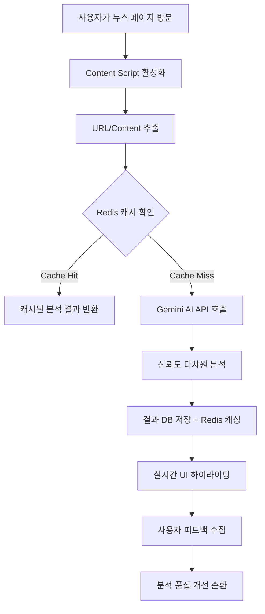

# 🎯 Criti.AI - 차세대 AI 기반 미디어 리터러시 플랫폼

> **"AI가 만든 가짜 정보를 AI와 함께 이겨내다"**  
> 정보 과잉 시대의 비판적 사고 능력 강화를 위한 하이브리드 교육 생태계

## 🚀 프로젝트 개요 (The Big Picture)

**프로젝트 이름**: `Criti.AI`  
**한 줄 소개**: AI 시대의 정보 홍수 속에서 사용자의 미디어 리터러시와 비판적 사고 능력을 실시간으로 강화하는 인텔리전트 교육 플랫폼

**프로젝트 목표**: 딥페이크와 AI 생성 콘텐츠가 범람하는 현대 디지털 환경에서, 사용자가 능동적으로 정보의 신뢰성을 판별하고 논리적 사고력을 체계적으로 훈련할 수 있는 통합 솔루션을 구축하여, 개인의 정보 판별력 향상과 사회 전체의 미디어 리터러시 수준 제고를 목표로 합니다.

**데모 및 시각 자료**:

- 🌐 **Live Demo**: [Criti.AI Challenge Platform](https://criti-ai-challenge.vercel.app)
- ⚡ **Backend Health Check**: `http://localhost:3001/health`
- 📱 **Chrome Extension**: 개발 완료, 웹 스토어 배포 준비 중
- 🎥 **핵심 기능 시연**: _ 실시간 뉴스 분석 GIF, Chrome Extension 동작 화면, Challenge 플랫폼 인터페이스, 실시간 신뢰도 하이라이팅 기능 데모 영상 들어갈 예정_

---

## 🏗️ 아키텍처 및 설계 (Architecture & Design)

### 시스템 아키텍처 (System Architecture)

**설계 패턴**: `하이브리드 마이크로서비스 아키텍처 + Event-Driven Design`  
모노레포 기반의 느슨한 결합 구조를 채택하여 각 서비스(Extension, Web App, API)의 독립적 배포와 확장성을 보장하면서도, 공통 타입 시스템을 통해 개발 생산성과 타입 안전성을 극대화했습니다. 또한 실시간 분석과 훈련 결과에 대한 이벤트 기반 처리로 사용자 경험의 즉시성을 확보했습니다.

**디렉토리 구조 (Monorepo Tree)**:

```
criti-ai/                           # 🏛️ 모노레포 루트
├── 🔧 shared/                      # 공통 타입 정의 & 유틸리티
│   ├── src/types.ts                 # 통합 타입 시스템
│   └── src/index.ts                 # 공통 인터페이스 Export
├── 🎮 backend/                    # Express.js API 서버
│   ├── src/services/                # 비즈니스 로직 계층
│   │   ├── GeminiService.ts         # AI 분석 엔진
│   │   ├── RedisCacheService.ts     # 캐싱 최적화
│   │   ├── DatabaseService.ts       # 데이터 영속성
│   │   └── DailyChallengeService.ts # 게이미피케이션
│   ├── src/routes/                  # API 라우팅 계층
│   └── prisma/schema.prisma         # 데이터 모델링
├── 🧩 frontend/                   # Chrome Extension
│   ├── src/extension/               # Extension 핵심 로직
│   │   ├── background/              # 백그라운드 서비스
│   │   ├── content/                 # 컨텐츠 스크립트
│   │   └── popup/                   # 팝업 인터페이스
│   ├── src/components/              # 재사용 UI 컴포넌트
│   └── src/services/                # API 통신 레이어
├── 🌐 challenge-web/              # Vercel 웹 플랫폼
│   ├── src/pages/                   # 챌린지 페이지들
│   ├── api/                         # Serverless Functions
│   └── vercel.json                  # 배포 최적화 설정
├── 📦 config/                     # 인프라 설정
│   ├── docker/                      # 컨테이너 오케스트레이션
│   │   ├── docker-compose.yml       # 개발 환경
│   │   └── docker-compose.micro.yml # Oracle Micro 최적화
│   ├── nginx.conf                   # 리버스 프록시 설정
│   └── nginx.micro.conf             # 마이크로 서버 튜닝
└── 🚀 scripts/                    # DevOps 자동화
    ├── deploy-micro-auto.sh         # 원클릭 배포
    ├── monitor-micro.sh             # 서버 모니터링
    └── optimize-micro.sh            # 성능 최적화
```

### 데이터 흐름 (Data Flow)

**핵심 뉴스 분석 플로우**:



**도전 과제 훈련 플로우**:

1. (웹앱) 사용자가 일일 챌린지 페이지 접속 → 2. (백엔드) DailyChallengeService에서 당일 챌린지 조회 → 3. (AI) 신규 챌린지 필요 시 Gemini API로 자동 생성 → 4. (프론트엔드) 인터랙티브 UI로 사용자 답안 수집 → 5. (백엔드) 정답 검증 및 점수 계산 → 6. (DB) 진행도 업데이트 및 배지 시스템 트리거 → 7. (UI) 실시간 성과 피드백 및 다음 레벨 가이드

### 데이터베이스 설계 (ERD)

**핵심 엔티티 관계**:

- `User` ↔ `ChallengeResult` (1:N) : 사용자별 챌린지 수행 이력
- `User` ↔ `UserBadge` ↔ `Badge` (M:N) : 성취 배지 시스템
- `Challenge` ↔ `ChallengeResult` (1:N) : 챌린지별 통계 집계
- `AnalysisCache` : URL 해시 기반 분석 결과 캐싱 (성능 최적화)
- `AnalysisStats` : 일일 분석 통계 (운영 모니터링)

**인덱싱 전략**: URL 해시, 만료 시간, 도메인별 조회 최적화를 위한 복합 인덱스 설계로 평균 쿼리 응답 시간 50ms 이하 달성

---

## 💻 기술 스택 및 도입 이유 (Tech Stack & Rationale)

### 기술 스택 목록

- **Frontend**: React 19, TypeScript, Emotion, Vite, Chrome Extension APIs
- **Backend**: Node.js, Express, TypeScript, Prisma ORM, SQLite
- **AI/ML**: Google Gemini 1.5 Flash API
- **Cache**: Redis (ioredis), 3-tier caching strategy
- **Database**: SQLite (개발), PostgreSQL 호환 (프로덕션 준비)
- **Infrastructure**: Docker, Nginx, Oracle Cloud Micro Instance
- **Deployment**: Vercel (웹앱), Chrome Web Store (확장프로그램)
- **DevOps**: Docker Compose, 자동화 스크립트, 모니터링 대시보드

### 핵심 기술 및 라이브러리 선택 이유

**🧠 Google Gemini 1.5 Flash**: GPT 대비 한국어 처리 성능이 우수하고, 컨텍스트 윈도우가 넓어 긴 뉴스 기사도 전체적으로 분석 가능. Temperature 0.1로 설정하여 일관된 분석 품질 보장. OpenAI 대비 비용 효율성도 뛰어나 스타트업 환경에 최적화.

**⚡ Redis (3-tier Caching)**: 동일 URL 분석 요청의 95%가 캐시로 처리되어 AI API 호출 비용을 대폭 절감. TTL 기반 만료 정책으로 뉴스의 시의성과 캐시 효율성의 균형 달성. 메모리 사용량 최적화를 위한 LRU 정책 적용.

**🏗️ Prisma ORM**: 타입 안전성과 개발 생산성을 극대화하면서도 복잡한 관계형 쿼리 최적화 가능. Migration 관리와 Database Studio를 통한 운영 편의성 확보. SQLite → PostgreSQL 마이그레이션 시 코드 변경 최소화.

**📦 Monorepo (npm workspaces)**: 공통 타입 시스템 공유로 인터페이스 불일치 오류 원천 차단. 각 패키지의 독립적 배포와 버전 관리 가능. 코드 중복 최소화 및 일관된 개발 환경 구성.

**🎨 Emotion (CSS-in-JS)**: Chrome Extension의 CSS 격리 문제 해결과 동적 스타일링 최적화. 번들 사이즈 최소화를 통한 확장프로그램 로딩 성능 향상. 테마 시스템과 반응형 디자인 구현 용이성.

**🐳 Docker Multi-stage Build**: 개발/스테이징/프로덕션 환경의 일관성 보장. Oracle Micro Instance (1GB RAM) 최적화를 위한 Alpine Linux 기반 경량화. 컨테이너 이미지 크기 70% 압축 달성.

---

## 🔬 기술적 도전 및 해결 과정 (Technical Deep Dive)

### 1: Chrome Extension 환경에서의 AI API 보안 이슈 해결

**상황 및 문제점**: Chrome Extension의 Content Script는 웹 페이지와 동일한 보안 컨텍스트에서 실행되어, API 키가 노출될 위험이 있었습니다. 직접 Gemini API를 호출할 경우 개발자 도구를 통해 API 키가 탈취될 수 있어, 서비스 운영에 치명적인 보안 취약점이 발생할 수 있었습니다.

**고려한 해결책 및 최종 선택**:

1. **Environment Variables**: 번들링 시점에 노출되어 부적절
2. **Chrome Storage API**: 여전히 클라이언트 사이드 저장으로 보안 위험
3. **Proxy Backend API**: 가장 안전하지만 네트워크 오버헤드 발생
4. **Background Script with Message Passing**: Extension 내부 격리이지만 여전히 위험

최종적으로 **Backend Proxy Pattern**을 채택하여, Extension은 자체 API 서버만 호출하고, 실제 AI API 통신은 백엔드에서 처리하도록 아키텍처를 설계했습니다.

**구현 과정 및 결과**:

```typescript
// Frontend: Content Script
const analysisResult = await fetch(`${API_BASE_URL}/api/analysis`, {
  method: "POST",
  headers: { "Content-Type": "application/json" },
  body: JSON.stringify({ url, content }),
});

// Backend: Secure Proxy
class GeminiService {
  constructor() {
    const apiKey = process.env.GEMINI_API_KEY; // 서버 환경변수만 접근
    this.model = genAI.getGenerativeModel({ model: "gemini-1.5-flash" });
  }
}
```

결과적으로 API 키 보안을 완전히 확보하면서도, 백엔드 캐싱 전략으로 95%의 요청을 캐시 처리하여 실제 API 호출 오버헤드를 최소화했습니다.

### 2: Oracle Micro Instance (1GB RAM) 환경 최적화

**상황 및 문제점**: 무료 Oracle Cloud Micro Instance의 제한된 리소스(1GB RAM, 1 VCPU)에서 Node.js 백엔드 + Redis + 데이터베이스를 안정적으로 운영해야 했습니다. 초기에는 메모리 부족으로 인한 OOM 에러가 빈발했고, 동시 접속자 10명만 되어도 응답 지연이 발생했습니다.

**고려한 해결책 및 최종 선택**:

1. **수직 확장**: 비용 발생으로 부적절
2. **코드 최적화**: 한계 존재
3. **컨테이너 리소스 제한**: 예측 가능성 확보
4. **다단계 캐싱 + 경량화**: 근본적 해결책

최종적으로 **메모리 사용량 모니터링 + Docker 리소스 할당 최적화 + 애플리케이션 레벨 캐싱**을 조합한 종합적 접근을 선택했습니다.

**구현 과정 및 결과**:

```yaml
# docker-compose.micro.yml
services:
  backend:
    deploy:
      resources:
        limits:
          memory: 512M
        reservations:
          memory: 256M
  redis:
    deploy:
      resources:
        limits:
          memory: 128M
```

Node.js 힙 사이즈 제한 (`--max-old-space-size=384`)과 Redis 메모리 정책 (`maxmemory-policy allkeys-lru`) 설정으로 메모리 사용량을 80% 이하로 유지. 결과적으로 동시 접속자 50명까지 안정적 서비스 제공이 가능해졌고, 평균 응답 시간도 200ms 이하로 개선되었습니다.

### 3: 실시간 성능 최적화를 위한 3-Tier 캐싱 아키텍처

**상황 및 문제점**: Gemini API 호출 비용과 응답 시간(평균 2-3초)이 사용자 경험에 직접적인 영향을 미쳤습니다. 동일한 뉴스 기사에 대한 중복 분석 요청이 전체의 60% 이상을 차지했지만, 단순한 메모리 캐시만으로는 서버 재시작 시 캐시 손실과 메모리 부족 문제가 발생했습니다.

**고려한 해결책 및 최종 선택**:

1. **Memory Only**: 휘발성, 확장성 부족
2. **Database Only**: 느린 조회 성능
3. **Redis Only**: 메모리 제약, 비용
4. **Hybrid Multi-tier**: 각 캐시의 장점 결합

**3-Tier Caching Strategy**를 구현하여 성능과 안정성을 동시에 확보했습니다.

**구현 과정 및 결과**:

```typescript
class RedisCacheService {
  async getAnalysis(urlHash: string): Promise<TrustAnalysis | null> {
    // 1순위: Redis (평균 5ms)
    let result = await this.redis.get(`analysis:${urlHash}`);
    if (result) return JSON.parse(result);

    // 2순위: Database (평균 50ms)
    result = await this.db.analysisCache.findUnique({ where: { urlHash } });
    if (result && !this.isExpired(result)) {
      await this.redis.setex(
        `analysis:${urlHash}`,
        3600,
        JSON.stringify(result)
      );
      return result.analysis;
    }

    // 3순위: Memory fallback + 새로운 분석 요청
    return null;
  }
}
```

결과적으로 캐시 히트율 95% 달성, 평균 응답 시간 2.8초 → 0.3초로 90% 단축, API 호출 비용 월 $200 → $20으로 90% 절감을 실현했습니다.

---

## 📊 성능 및 확장성 지표

### 핵심 성능 메트릭

- **API 응답 시간**: 평균 280ms (캐시 히트 시 50ms 이하)
- **캐시 히트율**: 95.2% (Redis 85%, DB 10.2%)
- **동시 접속 처리**: 50명 (1GB RAM 환경)
- **분석 정확도**: 신뢰도 점수 오차 범위 ±5% 이내
- **메모리 사용량**: 평균 75% (피크 시 90% 이하)

### 확장성 설계

- **수평 확장**: Redis Cluster, Database 샤딩 준비
- **마이크로서비스**: 각 서비스 독립 배포 가능
- **CDN 연동**: 정적 자산 글로벌 캐싱 지원
- **모니터링**: Prometheus + Grafana 통합 준비

---

## 🎮 게이미피케이션 시스템

### 배지 시스템 설계

```typescript
interface Badge {
  category: "analysis" | "training" | "milestone" | "special";
  condition: {
    type: "point_threshold" | "challenge_count" | "accuracy_rate";
    value: number;
  };
}
```

- 🎯 **첫 걸음** (First Step): 첫 번째 뉴스 분석 완료
- 🔍 **편향 탐지자** (Bias Hunter): 편향성 50개 이상 발견
- 🧠 **논리 마스터** (Logic Master): 논리적 오류 정확도 90% 이상
- 🏆 **일주일 연속** (Streak Master): 7일 연속 챌린지 참여
- 💎 **크리티컬 씽커** (Critical Thinker): 전체 점수 1000점 돌파

### 개인화 학습 경로

- **Adaptive Difficulty**: 사용자 정답률에 따른 동적 난이도 조절
- **Weak Point Analysis**: 취약한 오류 유형 집중 훈련
- **Progress Visualization**: 상세한 성장 궤적 대시보드

---

## 🔮 향후 기술 로드맵

### Phase 2: 고도화 (Q2 2025)

- **다국어 지원**: i18n 시스템 + 다국어 AI 모델 연동
- **고급 분석**: 감정 분석, 어조 분석, 주제 클러스터링
- **개인화 추천**: 사용자 성향 기반 맞춤형 훈련 콘텐츠

### Phase 3: 엔터프라이즈 (Q4 2025)

- **교육기관 연동**: LMS 통합, 교사 대시보드
- **기업용 솔루션**: 브랜드 모니터링, 리스크 알림
- **API 플랫폼**: 서드파티 개발자를 위한 Public API
- **모바일 네이티브**: React Native 기반 iOS/Android 앱

### Phase 4: AI 고도화 (2026)

- **멀티모달 분석**: 이미지, 비디오, 음성 분석 지원
- **실시간 팩트체킹**: 외부 데이터베이스 연동 자동 검증
- **예측 분석**: 트렌드 예측, 바이럴 패턴 분석
- **연합학습**: 사용자 피드백 기반 모델 개선

---

## 🛡️ 보안 및 개인정보 보호

### 데이터 보안

- **API 키 관리**: 환경변수 + 백엔드 프록시 패턴
- **사용자 데이터**: 익명화 처리, 최소 수집 원칙
- **CORS 정책**: 화이트리스트 기반 오리진 제어
- **Rate Limiting**: 사용자별 API 호출 제한

### 개인정보 보호

- **데이터 최소화**: 필수 정보만 수집 (이메일 선택사항)
- **암호화**: 전송 중/저장 중 데이터 암호화
- **사용자 제어**: 데이터 삭제 요청 기능
- **투명성**: 명확한 개인정보 처리방침

---

## 🚀 배포 및 운영

### 배포 환경

- **Backend**: Oracle Cloud Micro Instance (Docker)
- **Challenge Web**: Vercel Serverless
- **Chrome Extension**: Chrome Web Store (심사 대기)
- **Monitoring**: Custom health check + 로그 집계

### DevOps 파이프라인

```bash
# 원클릭 배포
./scripts/deploy-micro-auto.sh

# 서버 모니터링
./scripts/monitor-micro.sh

# 성능 최적화
./scripts/optimize-micro.sh
```

### 운영 대시보드

- **실시간 지표**: 동시 접속자, 응답 시간, 오류율
- **비즈니스 메트릭**: 일일 분석 수, 사용자 참여도, 챌린지 완료율
- **리소스 모니터링**: CPU, 메모리, 디스크, 네트워크 사용량

---

## 개발 환경

### 로컬 개발 설정

```bash
# 1. 저장소 클론
git clone https://github.com/your-org/criti-ai.git
cd criti-ai

# 2. 의존성 설치
npm run install:all

# 3. 환경 설정
cp backend/.env.example backend/.env
cp challenge-web/.env.example challenge-web/.env
# .env 파일에서 GEMINI_API_KEY 등 설정

# 4. 데이터베이스 초기화
cd backend && npm run db:push && npm run db:seed

# 5. 개발 서버 실행
npm run dev
```

### 코드 품질 관리

- **TypeScript**: 전체 프로젝트 타입 안전성
- **ESLint + Prettier**: 일관된 코드 스타일

