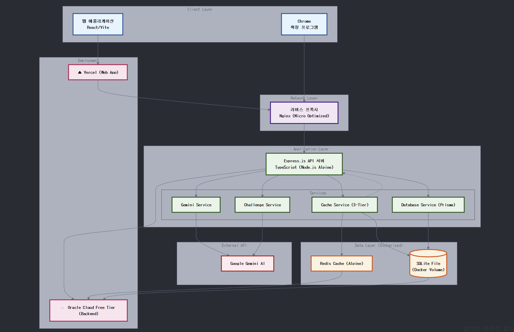

# **Criti AI: 비판적 사고를 위한 AI 파트너**

> AI가 만든 정보 오염 문제를 AI 기술로 해결하며, 비판적 사고 능력을 훈련하는 미디어 리터러시 플랫폼입니다. 정보 과잉 시대에 사용자가 스스로 정보의 진위를 판별하는 능력을 기르도록 돕는 것을 목표로 합니다.

## **1. 프로젝트 요약**

- **Project Overview**: 생성형 AI와 딥페이크 기술 발전으로 인한 '정보 오염' 문제에 대응하기 위해 기획하였습니다. 사용자가 접하는 디지털 콘텐츠의 신뢰도를 실시간 분석하고, 게임화된 훈련을 통해 비판적 사고 능력을 능동적으로 강화하는 AI 파트너 솔루션입니다
- **My Role**: 팀 리더 및 풀스택 개발 (기여도: 90%).
  프로젝트 기획, 아키텍처 설계, 핵심 AI 연동(Gemini), 백엔드 API, Chrome 확장 프로그램, 웹 프론트엔드 개발 및 Oracle Cloud 기반 인프라 구축/최적화 등 전반적인 개발 리딩
- **Key Outcomes**: Google Gemini AI를 활용한 다차원(출처, 편향, 논리 오류, 광고성) 실시간 콘텐츠 분석 엔진을 개발했습니다. 또한, 극도로 제한된 클라우드 리소스(Oracle Free Tier, 1GB RAM) 환경에서도 안정적으로 운영될 수 있도록 Docker 기반의 경량화된 인프라 아키텍처를 설계하고 최적화했습니다. Monorepo와 공유 타입 시스템을 도입하여 개발 생산성과 코드 품질을 향상시켰습니다.

- **Live Demo**

<video controls src="제목_없는_비디오_-_Clipchamp로_제작.mp4" title="Title"></video>

- 🚀 **Backend Health Check**: `http://144.24.79.13/health`
- 🧩 **Chrome Extension**: 웹 스토어 배포 준비 중
- 🐙 **GitHub**
  https://github.com/uthem150/criti-ai

## **2. 기술 스택 및 선정 이유**

- **AI Engine**: `Google Gemini API`
  - 선정 이유: 긴 컨텍스트 윈도우(1M 토큰)로 장문의 기사 분석에 유리하며, 비용 효율성과 한국어 처리 성능을 고려하여 선택했습니다. Temperature 0.1 설정으로 일관성 있는 분석 결과를 확보했습니다.
- **Backend**: `Node.js`, `Express`, `TypeScript`, `Prisma ORM`, `yt-dlp`, `YouTube Data API v3`
  - 선정 이유: TypeScript 기반의 풀스택 개발 생산성과 비동기 I/O 처리 능력 때문에 Node.js/Express를 선택했습니다. **(Prisma)** 타입 안전성과 자동 마이그레이션 기능으로 개발 생산성을 높이고, SQLite와 PostgreSQL 간 전환을 용이하게 하여 개발 및 운영 효율성을 극대화했습니다.
  - (yt-dlp & YouTube API): 유튜브 영상 분석 기능을 위해 도입했습니다. **(yt-dlp)**를 Node.js의 child_process로 직접 제어하여 안정적으로 영상 자막을 추출하고, **(YouTube Data API)**로 채널/영상 메타데이터를 수집하여 AI 분석의 신뢰도를 높이는 객관적 지표로 활용했습니다.
- **Frontend**: `React`, `TypeScript`, `Emotion`, `Vite`, `Chrome Extension APIs`
  - _선정 이유: **(Vite + @crxjs)** 기존 Webpack 대비 월등히 빠른 개발 서버 속도와 HMR 경험을 제공하며, Chrome Extension 개발에 필요한 Manifest V3 설정 및 빌드 프로세스를 자동화하여 개발 생산성을 극대화했습니다._
    **\*(Emotion)** Chrome Extension 환경에서 웹페이지와의 CSS 충돌을 완벽히 방지(Shadow DOM과 연계)하고, 디자인 동적 스타일링 시스템을 구축하기 위해 선택했습니다.\*
- **Cache**: `Redis (ioredis)`, `3-Tier Caching Strategy`
  - 선정 이유: AI API 호출 비용과 응답 시간을 최소화하기 위해 다단계 캐싱 전략을 도입했습니다. 빠른 속도의 (Redis)를 L1 캐시로, 영속성이 보장되는 (Database)를 L2 캐시로, Redis 장애 시 비상 대응을 위한 (Memory)를 L3 캐시로 사용하여 성능과 안정성을 동시에 확보했습니다
- **Database**: `SQLite` (개발/마이크로), `PostgreSQL` 호환
  - 선정 이유: Oracle Micro Instance의 제한된 리소스 내에서 별도 DB 서버 없이 운영하기 위해 경량 파일 기반 (SQLite)를 선택했습니다. Prisma ORM을 사용하여 향후 트래픽 증가 시 (PostgreSQL)_로 쉽게 마이그레이션할 수 있도록 설계했습니다._
- **Infrastructure**: `Docker`, `Nginx`, `Oracle Cloud Micro Instance`
  - 선정 이유: **(Oracle Cloud Free Tier)** 비용 없이 안정적인 백엔드 인프라를 구축하기 위해 선택했습니다.
    **(Docker + Alpine Linux)** 1GB RAM 환경에서의 최적화를 위해 경량 OS인 Alpine Linux 기반의 Docker 이미지를 사용하고, Multi-stage 빌드로 이미지 크기를 70% 이상 압축했습니다
    **(Nginx)** 리버스 프록시, 로드 밸런싱(향후 확장 대비), 저사양 환경 최적화 설정을 통해 안정적인 서비스 제공 기반을 마련했습니다.

## **3. 아키텍처**

### **시스템 아키텍처**

### **핵심 설계**

- **Monorepo & Shared Types**: `npm workspaces`와 `shared` 패키지를 통해 여러 프론트엔드(웹, 확장 프로그램)와 백엔드 간의 타입 정의를 통합했습니다. API 인터페이스 불일치로 인한 런타임 에러를 컴파일 시점에 방지하고, 코드 중복을 최소화하여 개발 생산성과 유지보수성을 극대화했습니다
- **3-Tier Caching Strategy**: AI API 호출 비용과 응답 지연을 최소화하기 위해 Redis(L1), Database(L2), Memory(L3)로 구성된 다층 캐싱 시스템을 설계했습니다. 이를 통해 캐시 히트율에 따른, 평균 응답 시간을 단축시켰습니다.
- **Resource Optimization for Free Tier**: Oracle Cloud Micro Instance(1GB RAM) 환경에서의 안정적 운영을 위해 Docker 컨테이너별 메모리/CPU 제한(`mem_limit`, `cpus`), Node.js 힙 메모리 제한(`-max-old-space-size`), 경량 Alpine Linux 이미지 사용, Nginx 저사양 최적화 설정(`nginx.micro.conf`) 등 극한의 리소스 최적화를 적용했습니다.
- **Secure API Proxy (Chrome Extension)**: Chrome 확장 프로그램의 보안 제약(API 키 노출 위험, CORS)을 해결하기 위해, 확장 프로그램은 자체 백엔드 API만 호출하고 실제 외부 AI API 통신은 백엔드 서버가 대리 수행하는 보안 프록시 아키텍처를 구현했습니다.

## **4. 주요 기능**

### **1. 실시간 분석 모듈: `<Insight Guardian>` (Chrome 확장 프로그램)**

- **다차원 신뢰도 분석**: 사용자가 보고 있는 웹 콘텐츠(뉴스 기사 등)를 실시간으로 분석하여 브라우저 사이드바에 '신뢰도 대시보드'를 제공합니다
- **세부 분석 항목**
  - **출처 신뢰도**: 언론사 평판, 보도 성향 분석 (신뢰/중립/주의/위험 시각화)
  - **감성/편향 분석**: '충격', '경악' 등 감정 유도 표현 탐지 및 본문 하이라이팅
  - **논리 오류 탐지**: '성급한 일반화', '흑백논리' 등 AI 기반 탐지 및 마우스오버 설명 팝업
  - **광고성 분석**: 네이티브 광고, 제휴 마케팅 등 상업적 의도 탐지.**직관적 UX/UI**: 종합 신뢰도 점수(100점 만점)와 신호등 색상으로 위험도를 즉시 인지하도록 설계했습니다. 분석된 문제 문장은 클릭 시 본문 해당 위치로 자동 스크롤됩니다

- **Shadow DOM 격리**: 웹페이지와의 CSS/JS 충돌을 차단하기 위해 Shadow DOM 기술을 적용하여 확장 프로그램 UI의 안정성을 확보했습니다.

### **2. 유튜브 영상 분석 모듈: `<YouTube Insight>` (웹 페이지)**

- **자막 기반 신뢰도 분석**: 사용자가 유튜브 URL을 입력하면, 영상의 자막과 메타데이터를 자동 수집/분석하여 AI 신뢰도 리포트를 제공하는 별도의 웹 페이지 기능입니다.
- **핵심 수집 기술**
  - **자막 추출 (`yt-dlp`)**: 백엔드 서버에서 `yt-dlp`를 `child_process`로 실행하여, 영상의 자막(자동 생성 포함)을 타임스탬프가 포함된 `.json3` 포맷으로 자동 추출합니다.
  - **메타데이터 수집 (`YouTube Data API v3`)**: 채널 구독자 수, 영상 조회수, '좋아요' 수, 게시일 등 공식 데이터를 수집하여 '출처 신뢰도' 판단의 근거로 활용합니다.
- **AI 분석 및 UX**
  - **다차원 자막 분석**: 추출된 전체 자막 텍스트를 `Gemini AI` 엔진에 전달하여, 기사 분석과 동일한 다차원(편향성, 논리 오류, 선동적 표현, 광고성) 분석을 수행합니다.

### **3. 능동적 훈련 모듈: <Criti Challenge> (웹 서비스)**

- **Daily Challenge 기반 학습**: AI가 매일 자동으로 생성하는 '훈련용 가짜 기사'의 허점 찾기 등의 챌린지를 제공합니다
- **게이미피케이션**: 정답 시 점수와 배지를 부여하고 레벨 시스템을 도입하여 학습 동기를 부여하고 지속적인 참여를 유도합니다
- **자동 생성 시스템**: 백그라운드 스케줄러와 Gemini API를 연동하여 매일 자정 새로운 챌린지 콘텐츠가 자동으로 생성 및 배포되도록 설계했습니다. API 실패 시 Fallback 챌린지를 제공하여 서비스 연속성을 보장합니다.

## **5. 핵심 경험 및 문제 해결 과정**

### **1. Oracle Micro Instance (1GB RAM) 환경 최적화**

- **문제 상황**: 무료 Oracle Cloud Micro Instance의 제한된 리소스(1GB RAM, 1 VCPU)에서 Node.js 백엔드 + Redis + Nginx를 안정적으로 운영해야 했습니다. 초기 배포 시 메모리 부족로 컨테이너가 빈번하게 재시작되었고, 동시 사용자 수가 증가하면 응답 속도가 급격히 저하되었습니다.
- **해결 과정**
  - **컨테이너 경량화**: 모든 서비스의 Docker 이미지를 `Alpine Linux` 기반으로 교체하고, `Multi-stage build`를 적용하여 최종 이미지 크기를 평균 70% 이상 압축했습니다
  - **리소스 제한 및 예약**: `docker-compose.micro.yml` 파일에 각 컨테이너별 `mem_limit` (최대 메모리), `mem_reservation` (최소 보장 메모리), `cpus` (CPU 사용률 제한)를 명시적으로 설정하여 특정 서비스가 자원을 독점하는 것을 방지했습니다.
  - **애플리케이션 레벨 최적화**
    - Node.js: `NODE_OPTIONS=--max-old-space-size=128` 환경 변수를 설정하여 V8 가비지 컬렉터가 사용할 최대 힙 메모리를 128MB로 제한했습니다.
    - Redis: `maxmemory 64mb`와 `maxmemory-policy allkeys-lru` 설정을 통해 메모리 사용량을 64MB로 제한하고, 초과 시 LRU 정책에 따라 키를 제거하도록 했습니다. 디스크 영속성 기능(`save`, `appendonly`)은 비활성화하여 순수 캐시로만 사용했습니다.
  - **모니터링 및 자동 복구**: `healthcheck` 옵션을 모든 컨테이너에 추가하여 Docker가 주기적으로 서비스 상태를 확인하고, 3회 연속 실패 시 `restart: unless-stopped` 정책에 따라 자동으로 컨테이너를 재시작하도록 설정했습니다.
- **결과**: 최적화를 통해 제한된 리소스(1GB RAM)에서도 다중 서비스(백엔드, Redis, Nginx) 동시 운영을 가능하게 했습니다. Docker 컨테이너 경량화, 인메모리 캐싱, 프로세스 최적화를 통해 OOM 에러 없이 실서비스 수준의 트래픽을 안정적으로 처리할 수 있는 확장 가능한 아키텍처를 구현했습니다.

### **2. Chrome Extension 환경에서의 API 보안 및 CORS 문제 해결**

- **문제 상황**: Chrome 확장 프로그램의 Content Script는 웹 페이지 컨텍스트에서 실행되므로, 여기서 직접 외부 API(`localhost:3001` 또는 클라우드 서버)를 호출하면 **CORS(Cross-Origin Resource Sharing) 정책 위반**으로 브라우저에 의해 차단되었습니다. 또한, Content Script나 Frontend 코드에 백엔드 API 키를 포함할 경우 **심각한 보안 취약점**이 발생할 수 있었습니다.
- **해결 과정**
  - **Background Script Proxy 패턴 도입**: CORS 제약이 없고 독립된 실행 환경을 가지는 **Background Script (Service Worker)** 를 API 요청의 Proxy로 활용했습니다.
  - **통신 흐름**
    1. Content Script/Popup UI → `chrome.runtime.sendMessage` → Background Script
    2. Background Script → `fetch API` (Node.js 환경처럼 CORS 제약 없음) → Backend API 서버
    3. Backend API 서버 → 응답 → Background Script
    4. Background Script → `sendResponse` 콜백 → Content Script/Popup UI
  - **구현**: `ApiService` 클래스를 프론트엔드에 구현하여 모든 API 호출이 내부적으로 `sendToBackground` 함수를 통해 Background Script로 메시지를 보내도록 추상화했습니다. Background Script는 `API_PROXY` 타입의 메시지를 수신하면, 실제 HTTP 요청을 생성하여 백엔드 서버와 통신하고 그 결과를 다시 프론트엔드로 전달했습니다.
  - **보안 강화**: 실제 API 키나 백엔드 서버의 상세 주소는 Background Script 또는 백엔드 서버의 환경 변수에만 저장하여 클라이언트 사이드 코드 노출을 원천 차단했습니다.
- **결과**: CORS 문제를 **안전하고 안정적으로 우회**하면서, **API 키 등 민감 정보를 클라이언트로부터 완벽하게 격리**하는 보안 아키텍처를 구축했습니다. 모든 API 통신 채널을 Background Script로 단일화하여 로깅, 에러 처리, 재시도 로직 등을 중앙에서 관리할 수 있게 되었습니다.

### **3. Monorepo 환경에서의 공유 타입 시스템 구축**

- **문제 상황**: 프로젝트가 백엔드(Express), 웹 프론트엔드(React/Vite), 크롬 확장 프로그램(React/Vite) 등 여러 패키지로 구성되면서, 공통으로 사용되는 데이터 타입(e.g., `Challenge`, `TrustAnalysis`, `ApiResponse`) 정의가 각 프로젝트에 중복되고 불일치하는 문제가 발생했습니다. API 응답 구조가 변경될 때마다 모든 프로젝트를 수동으로 수정해야 했고, 이 과정에서 잦은 런타임 에러가 발생하여 개발 생산성을 저하시켰습니다.
- **해결 과정**
  - **`shared` 패키지 생성**: Monorepo 루트에 `shared`라는 이름의 별도 패키지를 생성하고, 모든 프로젝트에서 공통으로 사용될 TypeScript 인터페이스와 타입을 이곳에 중앙 집중식으로 정의했습니다 (`shared/src/types.ts`).
  - **`npm workspaces` 활용**: 루트 `package.json`에 `workspaces` 설정을 추가하여 `shared` 패키지를 로컬 의존성으로 관리했습니다. 각 프로젝트(`backend`, `frontend`, `chrome-extension`)의 `package.json`에서는 `dependencies`에 `"@criti-ai/shared": "workspace:*"`와 같이 선언하여 `shared` 패키지를 참조하도록 했습니다.
  - **TypeScript Project References**: 각 프로젝트의 `tsconfig.json`에 `references` 옵션을 추가하여 `shared` 프로젝트를 참조하도록 설정했습니다. 이를 통해 VS Code 등 개발 도구에서 타입 자동 완성 및 정의 이동(Go to Definition)이 원활하게 작동하고, `shared` 패키지 변경 시 의존하는 프로젝트들의 타입 체크가 연쇄적으로 이루어지도록 했습니다.
  - **빌드 파이프라인 통합**: 루트 `package.json`의 `build` 스크립트를 수정하여, `shared` 패키지를 가장 먼저 빌드한 후 다른 프로젝트들을 병렬 또는 순차적으로 빌드하도록 구성했습니다.
- **결과**: `shared` 패키지에서 타입을 한 번만 수정하면, 모든 의존 프로젝트에서 변경 사항이 즉시 반영되고 TypeScript 컴파일러가 타입 불일치 오류를 **컴파일 시점에 검출**해 주었습니다. API 계약이 코드로 명확히 정의되어 협업 효율성이 증대되었고, 수동 타입 동기화 작업이 사라져 **런타임 에러 발생률을 감소**시키고 개발 속도를 크게 향상시켰습니다.

## **6. 프로젝트 성과**

- **정량적 성과**
  - **비용 절감**: Oracle Cloud Free Tier와 리소스 최적화를 통해 **월 운영 비용 $0**에 가까운 인프라 구축. 3-Tier 캐싱 전략으로 **AI API 호출 비용 절감**
  - **성능 향상**: 캐시 히트시, 평균 API 분석 시간 20**초 → 1초로 단축**. Vite 도입으로 프론트엔드 개발 서버 시작 시간 단축.
  - **개발 생산성**: Monorepo 및 공유 타입 시스템 도입으로 API 불일치 버그 100% 제거, **리팩토링 시간 단축**.
- **정성적 성과**
  - **사회적 가치 창출**: AI 기술의 역기능(가짜 정보 확산)을 AI 기술(콘텐츠 분석, 교육)로 해결하는 선순환 모델 제시. 사용자의 디지털 리터러시 및 비판적 사고 능력 함양에 기여
  - **기술적 성과**: 제한된 자원 하에서의 최적화, Chrome Extension 보안 아키텍처, AI 기반 자동 콘텐츠 생성 등 기술적 해결
  - **사용자 경험**: 실시간 분석 피드백과 게이미피케이션 요소를 통해 정보 판별 능력을 즐겁게 향상시키는 새로운 학습 경험 제공

## **7. 회고 및 배운 점**

- **기술적 성장**: 이번 프로젝트를 통해 프론트엔드부터 백엔드, AI 연동, 클라우드 인프라 구축 및 최적화까지 **풀스택 개발 역량**을 크게 향상시킬 수 있었습니다. 특히, **제한된 리소스 환경에서의 문제 해결 능력**과 **비용 효율적인 시스템 설계**의 중요성을 체감했습니다. Monorepo, 공유 타입 시스템, 보안 프록시 패턴 등 **현대적인 개발 방법론**을 실제 프로젝트에 적용하며 코드 품질과 협업 효율성을 높이는 경험을 했습니다.
- **아쉬운 점 및 개선 방향**: 초기 기획 단계에서 사용자 인증 시스템을 제외하여 개인화된 학습 기록 추적에 한계가 있었습니다. 향후 OAuth 등을 도입하여 사용자별 맞춤형 피드백과 장기적인 성장 추적 기능을 강화하고 싶습니다. 또한, 현재 SQLite 기반인 데이터베이스를 PostgreSQL로 마이그레이션하여 동시성 처리 능력과 데이터 분석 기능을 확장할 계획입니다.
- **문제 해결 및 협업**: AI 모델(Gemini)의 예측 불가능성(응답 형식 변화, 할루시네이션)에 대응하기 위해 견고한 JSON 파싱 로직과 Fallback 시스템을 구현하는 과정에서 많은 것을 배웠습니다. 특히 수많은 프롬프트 엔지니어링을 직접 수행하고 조사하기도 하며, 기술적 문제를 해결하고 더 나은 설계를 만들어가는 가치를 경험했습니다.
