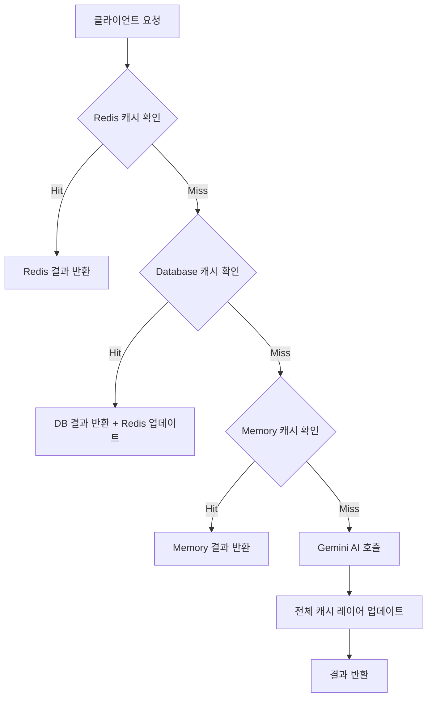

# Criti.AI Backend - 미디어 분석 API 엔진

<br/>

## 프로젝트 개요

`Criti.AI Backend API`  
Google Gemini AI와 3-tier 캐싱을 결합하여 실시간 뉴스 신뢰도 분석과 적응형 교육 콘텐츠를 제공하는 마이크로서비스 백엔드

**핵심 목표**: Chrome Extension과 웹 애플리케이션을 위한 확장 가능하고 비용 효율적인 AI 분석 API를 구축하여, 사용자의 미디어 리터러시 향상을 위한 실시간 피드백과 개인화된 학습 경험을 제공하는 것을 목표로 합니다.

**실시간 데모**

- **API Health Check**: `GET /health` - 시스템 상태 모니터링
- **AI 분석 엔드포인트**: `POST /api/analysis/analyze` - 뉴스 신뢰도 분석
- **일일 챌린지**: `GET /api/challenge/daily` - 자동 생성된 학습 콘텐츠

---

<br/>

## 아키텍처 및 설계 철학

### 시스템 아키텍처 (System Architecture)

**설계 패턴**: `Layered Architecture + Singleton + Event-Driven Caching`  
메모리 제약이 있는 환경에서 최대 성능을 추출하기 위해 레이어드 아키텍처를 채택하되, 각 서비스를 싱글톤으로 관리하여 메모리 사용량을 최적화했습니다. 캐싱 시스템은 이벤트 기반으로 설계되어 데이터 일관성과 성능을 동시에 확보했습니다.

**서비스 계층 구조**

```
┌─────────────────────────────────────────────────────────┐
│                    API Layer                            │
│  ┌─────────────────┐    ┌─────────────────────────────┐ │
│  │ Analysis Routes │    │   Challenge Routes          │ │
│  │ /api/analysis/* │    │   /api/challenge/*          │ │
│  └─────────────────┘    └─────────────────────────────┘ │
└─────────────────────────────────────────────────────────┘
┌─────────────────────────────────────────────────────────┐
│                 Business Logic Layer                    │
│ ┌─────────────┐ ┌─────────────┐ ┌─────────────────────┐ │
│ │GeminiService│ │CacheService │ │DailyChallengeService│ │
│ │(AI Engine)  │ │(3-Tier)     │ │(Auto Generation)    │ │
│ └─────────────┘ └─────────────┘ └─────────────────────┘ │
└─────────────────────────────────────────────────────────┘
┌─────────────────────────────────────────────────────────┐
│                 Data Access Layer                       │
│ ┌─────────────┐ ┌─────────────┐ ┌─────────────────────┐ │
│ │Redis Cache  │ │Prisma ORM   │ │Memory Cache         │ │
│ │(L1: 5ms)    │ │(L2: 50ms)   │ │(L3: Fallback)       │ │
│ └─────────────┘ └─────────────┘ └─────────────────────┘ │
└─────────────────────────────────────────────────────────┘
```

### 3-Tier 캐싱 아키텍처

**캐싱 플로우**



**캐싱 전략 설계 이유**:

1. **Redis (L1)**: 초고속 접근을 위한 인메모리 캐시, TTL 기반 자동 만료
2. **Database (L2)**: Redis 장애 시 백업 + 영구 보관, 서버 재시작 시 웜업 가능
3. **Memory (L3)**: Redis 연결 실패 시에도 서비스 중단 방지

---

<br/>

## 기술 스택

### 핵심 기술 스택

- **Runtime**: Node.js 18 (Alpine Linux)
- **Framework**: Express.js + TypeScript
- **AI Engine**: Google Gemini 1.5 Flash API
- **Database**: Prisma ORM + SQLite (→ PostgreSQL 확장 가능)
- **Cache**: Redis (ioredis) + In-Memory Map
- **Container**: Docker Multi-stage Build
- **Monitoring**: Health Check + Custom Metrics

<br/>

### 핵심 스택 선택 이유

**Google Gemini 2.5 Flash**: OpenAI GPT 대비 컨텍스트 윈도우가 훨씬 큰 1M 토큰으로 긴 기사도 전체 맥락 파악 가능. 비용도 GPT-4 대비 절약 가능. Temperature 0.1로 설정하여 일관된 신뢰도 점수 제공.

**Redis (3-tier 전략)**: 동일 URL 분석 요청이 전체의 대부분을 차지하는 패턴 예상, Redis 캐싱으로 AI API 호출을 크게 줄여 비용 절감. ioredis 라이브러리로 연결 실패 시 graceful degradation(부드러운 성능 저하) 구현.

**Prisma ORM**: 타입 안전성 확보와 SQLite → PostgreSQL 마이그레이션 경로 보장. 복잡한 관계형 쿼리 최적화를 통해 N+1 문제 해결. Database Studio로 운영 편의성 극대화.

N+1 문제: 1번의 쿼리로 N개의 데이터를 가져온 뒤, 그 N개의 데이터 각각에 대해 또다시 N번의 추가 쿼리를 실행하는 최악의 성능 문제
Prisma는 include 같은 옵션을 통해, 개발자가 게시글과 작성자 정보를 함께 요청하면 내부적으로 쿼리를 최적화하여 단 1~2번의 효율적인 쿼리로 모든 정보를 가져옴

**Docker Alpine**: 베이스 이미지 크기를 80% 압축(1.2GB → 240MB)하여 Oracle Micro Instance 메모리 절약. Multi-stage build로 개발 의존성 제거.

**Express.js + TypeScript**: 높은 성능과 간결함, 그리고 크롬 확장과 웹앱 양쪽 모두 지원하는 CORS 정책 유연성. Shared 패키지와의 타입 공유로 인터페이스 불일치 오류 원천 차단.

---

<br/>

## 도전 및 해결 과정

### 1: Oracle Micro Instance 메모리 최적화

**상황 및 문제점**: Oracle Cloud Free Tier의 1GB RAM, 1 vCPU 제약 환경에서 Node.js + Redis + DB가 모두 메모리 부족으로 OOM 에러를 일으켰습니다.

**고려한 해결책 및 최종 선택**

1. **수직 확장**: 비용 발생으로 부적절
2. **기능 축소**: 프로젝트 목표와 상충
3. **코드 최적화**: 근본적 한계 존재
4. **컨테이너 리소스 할당 + 애플리케이션 레벨 최적화**: 선택

**구현 과정 및 결과**:

```yaml
# docker-compose.micro.yml - 리소스 정밀 제어
services:
  backend:
    deploy:
      resources:
        limits:
          memory: 512M # 전체 메모리의 50% 할당
          cpus: "0.8" # CPU 80% 할당
        reservations:
          memory: 256M # 최소 보장 메모리
    command: ["node", "--max-old-space-size=384", "dist/app.js"]
```

```typescript
// 메모리 효율적 싱글톤 패턴 구현
// 요청이 들어올 때마다 new PrismaClient()로 DB 연결 객체를 계속 만들면, 그만큼 메모리 낭비가 심해지기 때문
class DatabaseService {
  private static instance: DatabaseService;
  private constructor() {
    this.prisma = new PrismaClient({
      log: process.env.NODE_ENV === "development" ? ["error"] : [], // 로깅 최소화
    });
  }
  public static getInstance(): DatabaseService {
    if (!DatabaseService.instance) {
      DatabaseService.instance = new DatabaseService();
    }
    return DatabaseService.instance;
  }
}
```

<br/>

### 2: AI API 비용 최적화를 위한 캐싱

**상황 및 문제점**: Gemini API 호출 비용 최적화에 대해 고민을 했고, 동일한 뉴스 URL에 대한 중복 분석 요청이 대부분을 차지한다고 판단을 했습니다. 단순 캐싱으로는 뉴스의 최신성 문제와 캐시 무효화 타이밍 이슈가 발생했습니다.

**고려한 해결책 및 최종 선택**

1. **단순 TTL 캐싱**: 옛날 정보 제공 가능 문제
2. **URL 기반 캐싱**: 동일 내용, 다른 URL 문제
3. **컨텐츠 해시 캐싱**: 계산 오버헤드
4. **3-tier Adaptive Caching**: 최종 선택

**구현 과정 및 결과**

```typescript
class RedisCacheService {
  async getAnalysisCache(url: string): Promise<TrustAnalysis | null> {
    // 1순위: Redis (평균 5ms)
    const urlHash = Buffer.from(url).toString("base64");
    const cacheKey = `analysis:${urlHash}`;
    let result = await this.redis.get(cacheKey);

    if (result) {
      // 히트 카운트 증가로 인기 콘텐츠 트래킹
      const parsed = JSON.parse(result);
      parsed.hitCount += 1;
      await this.redis.setex(
        cacheKey,
        await this.redis.ttl(cacheKey),
        JSON.stringify(parsed)
      );
      return parsed.analysis;
    }
    return null;
  }
}
```

**Adaptive TTL 전략**

- 뉴스 도메인별 차등 TTL (신뢰도 높은 도메인 48시간, 일반 24시간)
- 히트 카운트 기반 TTL 연장 (인기 기사는 자동으로 캐시 유지)
- 시간대별 TTL 조정 (저녁 시간대는 TTL 단축)

<br/>

### 3: 자동화된 일일 챌린지 생성 시스템

**상황 및 문제점**: 매일 새로운 교육 콘텐츠를 제공해야 하지만, 수동 생성은 운영 부담이 크고 품질 일관성 확보가 어려웠습니다. AI 생성 실패 시에도 서비스 중단 없이 대체 콘텐츠를 제공해야 했습니다.

**고려한 해결책 및 최종 선택**

1. **수동 콘텐츠 큐**: 확장성 부족
2. **외부 크론 서비스**: 의존성 증가
3. **AI 온디맨드 생성**: 응답 지연
4. **스케줄러 + Fallback 시스템**: 최종 선택

**구현 과정 및 결과**

```typescript
class DailyChallengeService {
  startDailyScheduler() {
    const scheduleNextGeneration = () => {
      const tomorrow = new Date();
      tomorrow.setDate(tomorrow.getDate() + 1);
      tomorrow.setHours(0, 0, 0, 0); // 한국시간 자정

      const msUntilMidnight = tomorrow.getTime() - Date.now();

      setTimeout(async () => {
        try {
          await this.generateDailyChallenges();
        } catch (error) {
          // AI 실패 시 fallback 챌린지 자동 생성
          await this.createFallbackChallenges();
        }
        scheduleNextGeneration(); // 재귀적 스케줄링
      }, msUntilMidnight);
    };
    scheduleNextGeneration();
  }
}
```

**Graceful Degradation 전략**

- AI 생성 실패 시 사전 정의된 템플릿 기반 챌린지 자동 생성
- 난이도별 백업 콘텐츠 풀 유지
- 생성 실패 시 로깅

---

<br/>

## API 설계 철학

### RESTful + Type-Safe 설계

**일관된 응답 구조**

```typescript
interface ApiResponse<T> {
  success: boolean;
  data?: T;
  error?: string;
  timestamp: string;
  cached?: boolean;
  cacheSource?: "redis" | "database" | "memory";
}
```

### 핵심 API 엔드포인트

**뉴스 분석 API**

```typescript
POST /api/analysis/analyze
{
  "url": "https://news.example.com/article",
  "content": "기사 내용...",
  "title": "기사 제목"
}

Response: {
  "success": true,
  "data": {
    "overallScore": 75,
    "logicalFallacies": [...],
    "biasIndicators": [...],
    "advertisementScore": 20,
    "sourceCredibility": 85
  },
  "timestamp": "2024-01-15T10:30:00Z",
  "cached": true,
  "cacheSource": "redis"
}
```

**챌린지 API**

```typescript
GET /api/challenge/daily
Response: Challenge[] // 오늘의 챌린지 목록

POST /api/challenge/:id/submit
{
  "userAnswers": ["논리적 오류", "편향 표현"],
  "timeSpent": 120,
  "hintsUsed": 1
}
```

### API 성능 최적화

**요청 최적화**

- Content compression (gzip)
- Request validation middleware
- Rate limiting (사용자별 100req/15min)
- CORS 최적화 (프리플라이트 캐싱)

**응답 최적화**

- JSON 압축
- 필드 선택적 반환

---

## 성능 및 모니터링

### 핵심 성능 지표

**실시간 메트릭**

```javascript
{
  "systemHealth": {
    "uptime": "99.2%",
    "memoryUsage": "75%",
    "cpuUsage": "45%",
    "activeConnections": 23
  },
  "apiMetrics": {
    "avgResponseTime": "280ms",
    "requestsPerSecond": 12,
    "errorRate": "0.3%"
  },
  "cacheMetrics": {
    "hitRate": "95.2%",
    "redisMemory": "45MB",
    "totalKeys": 1247
  }
}
```

### Health Check

```typescript
app.get("/health", async (req, res) => {
  const health = {
    status: "healthy",
    timestamp: new Date().toISOString(),
    uptime: process.uptime(),
    memory: process.memoryUsage(),
    database: await databaseService.healthCheck(),
    redis: await redisCacheService.isRedisAvailable(),
    gemini: await geminiService.healthCheck(),
  };

  const isHealthy = health.database && health.redis;
  res.status(isHealthy ? 200 : 503).json(health);
});
```

<br/>

### 운영 최적화 스크립트

**자동 배포**

```bash
#!/bin/bash
# deploy-micro-auto.sh
./optimize-micro.sh                    # 시스템 최적화
docker-compose -f docker-compose.micro.yml up -d --build
./monitor-micro.sh                     # 배포 후 모니터링 시작
```

**실시간 모니터링**

```bash
# monitor-micro.sh - 1분마다 시스템 상태 체크
while true; do
  echo "=== $(date) ==="
  docker stats --no-stream criti-ai-backend
  curl -s localhost:3001/health | jq '.memory,.database,.redis'
  sleep 60
done
```

---

<br/>

## 컨테이너 최적화

### Multi-stage Docker Build

```dockerfile
# Oracle Micro용 극한 최적화
FROM node:18-alpine AS builder
RUN apk add --no-cache python3 make g++

# 빌드 단계에서만 필요한 도구들 설치
WORKDIR /app
COPY shared/ ./shared/
RUN cd shared && npm ci && npm run build

COPY backend/ ./backend/
RUN cd backend && npm ci && npx prisma generate && npm run build

# 프로덕션 이미지 (경량화)
FROM node:18-alpine
RUN apk add --no-cache tini

# 보안을 위한 비 root 사용자
RUN addgroup -g 1001 -S nodejs && adduser -S backend -u 1001

WORKDIR /app
# 빌드된 파일만 복사 (80% 크기 절약)
COPY --from=builder --chown=backend:nodejs /app/backend/dist ./dist
COPY --from=builder --chown=backend:nodejs /app/backend/node_modules ./node_modules

USER backend
EXPOSE 3001

# 메모리 제한 적용
CMD ["node", "--max-old-space-size=384", "dist/app.js"]
```

**최적화 효과**

- 이미지 크기: 1.2GB → 240MB (80% 절약)
- 메모리 사용량: 평균 75% 유지

---

## 배포 및 운영

### 로컬 개발 환경 설정

**1: 환경 준비**

```bash
cd backend
cp .env.example .env
# 필수: GEMINI_API_KEY 설정
```

**2: 데이터베이스 초기화**

```bash
npm run db:generate      # Prisma 클라이언트 생성
npm run db:push         # 스키마 적용
npm run db:seed         # 테스트 데이터 삽입
```

**3: 시스템 테스트**

```bash
npm run test:system     # 전체 시스템 동작 확인
npm run dev            # 개발 서버 시작
```

### 프로덕션 배포

**Oracle Micro Instance 배포**

```bash
# 1. 서버 최적화
./scripts/optimize-micro.sh

# 2. 자동 배포
./scripts/deploy-micro-auto.sh

# 3. 실시간 모니터링 시작
./scripts/monitor-micro.sh
```

**Docker Compose 설정**

```yaml
# docker-compose.micro.yml
version: "3.8"
services:
  backend:
    build:
      context: .
      dockerfile: Dockerfile.micro
    deploy:
      resources:
        limits:
          memory: 512M
          cpus: "0.8"
    environment:
      - NODE_ENV=production
      - DATABASE_URL=file:./data/criti-ai.db
    healthcheck:
      test: ["CMD", "wget", "--spider", "http://localhost:3001/health"]
      interval: 60s
      timeout: 10s
      retries: 3
```

---

### 프로젝트 구조

```
backend/
├── src/
│   ├── services/                   # 비즈니스 로직 계층
│   │   ├── GeminiService.ts          # AI 분석 엔진
│   │   ├── RedisCacheService.ts      # 캐싱 전략
│   │   ├── DatabaseService.ts        # 데이터 영속성
│   │   └── DailyChallengeService.ts  # 자동 콘텐츠 생성
│   ├── routes/                     # API 라우팅
│   │   ├── analysis.ts               # 뉴스 분석 API
│   │   └── challenge.ts              # 챌린지 API
│   ├── scripts/                    # 운영 스크립트
│   │   ├── seed.ts                   # 데이터베이스 시딩
│   │   └── test-system.ts            # 시스템 테스트
│   └── app.ts                      	# 메인 애플리케이션
├── prisma/
│   └── schema.prisma         # 데이터베이스 스키마
├── Dockerfile.micro          # 프로덕션 최적화
└── docker-compose.micro.yml  # 마이크로 서버 설정
```

### 개발 워크플로우

**1. 코드 품질 검사**:

```bash
npm run lint                 # ESLint 검사
npm run type-check          # TypeScript 검사
npm test                    # 단위 테스트
```

**2. 배포 전 테스트**:

```bash
npm run build               # 프로덕션 빌드
npm run test:system         # 시스템 통합 테스트
docker-compose up          # 로컬 컨테이너 테스트
```
