# 🚀 Criti.AI Backend - 지능형 미디어 분석 API 엔진

> **"1GB RAM에서 50명 동시접속 처리하는 최적화된 AI 백엔드"**  
> 리소스 제약 환경에서도 구현한 고성능 API 서버

<br/>

## 🎯 프로젝트 개요

`Criti.AI Backend API`  
Google Gemini AI와 3-tier 캐싱을 결합하여 실시간 뉴스 신뢰도 분석과 적응형 교육 콘텐츠를 제공하는 마이크로서비스 백엔드

**핵심 목표**: Chrome Extension과 웹 애플리케이션을 위한 확장 가능하고 비용 효율적인 AI 분석 API를 구축하여, 사용자의 미디어 리터러시 향상을 위한 실시간 피드백과 개인화된 학습 경험을 제공하는 것을 목표로 합니다.

**실시간 데모**

- 🌐 **API Health Check**: `GET /health` - 시스템 상태 모니터링
- 🤖 **AI 분석 엔드포인트**: `POST /api/analysis/analyze` - 뉴스 신뢰도 분석
- 🎮 **일일 챌린지**: `GET /api/challenge/daily` - 자동 생성된 학습 콘텐츠

---

<br/>

## 🏗️ 아키텍처 및 설계 철학

### 시스템 아키텍처 (System Architecture)

**설계 패턴**: `Layered Architecture + Singleton + Event-Driven Caching`  
메모리 제약이 있는 환경에서 최대 성능을 추출하기 위해 레이어드 아키텍처를 채택하되, 각 서비스를 싱글톤으로 관리하여 메모리 사용량을 최적화했습니다. 캐싱 시스템은 이벤트 기반으로 설계되어 데이터 일관성과 성능을 동시에 확보했습니다.

**서비스 계층 구조**

```
┌─────────────────────────────────────────────────────────┐
│                    API Layer                            │
│  ┌─────────────────┐    ┌─────────────────────────────┐ │
│  │ Analysis Routes │    │   Challenge Routes          │ │
│  │ /api/analysis/* │    │   /api/challenge/*          │ │
│  └─────────────────┘    └─────────────────────────────┘ │
└─────────────────────────────────────────────────────────┘
┌─────────────────────────────────────────────────────────┐
│                 Business Logic Layer                    │
│ ┌─────────────┐ ┌─────────────┐ ┌─────────────────────┐ │
│ │GeminiService│ │CacheService │ │DailyChallengeService│ │
│ │(AI Engine)  │ │(3-Tier)     │ │(Auto Generation)    │ │
│ └─────────────┘ └─────────────┘ └─────────────────────┘ │
└─────────────────────────────────────────────────────────┘
┌─────────────────────────────────────────────────────────┐
│                 Data Access Layer                       │
│ ┌─────────────┐ ┌─────────────┐ ┌─────────────────────┐ │
│ │Redis Cache  │ │Prisma ORM   │ │Memory Cache         │ │
│ │(L1: 5ms)    │ │(L2: 50ms)   │ │(L3: Fallback)       │ │
│ └─────────────┘ └─────────────┘ └─────────────────────┘ │
└─────────────────────────────────────────────────────────┘
```

### 3-Tier 캐싱 아키텍처

**캐싱 플로우**

```mermaid
graph TD
    A[클라이언트 요청] --> B{Redis 캐시 확인}
    B -->|Hit: 95%| C[Redis 결과 반환<br/>⚡ 5ms]
    B -->|Miss: 5%| D{Database 캐시 확인}
    D -->|Hit: 4%| E[DB 결과 반환 + Redis 업데이트<br/>💾 50ms]
    D -->|Miss: 1%| F{Memory 캐시 확인}
    F -->|Hit: 0.8%| G[Memory 결과 반환<br/>🧠 1ms]
    F -->|Miss: 0.2%| H[Gemini AI 호출<br/>🤖 2.5s]
    H --> I[전체 캐시 레이어 업데이트]
    I --> J[결과 반환]
```



**캐싱 전략 설계 이유**:

1. **Redis (L1)**: 초고속 접근을 위한 인메모리 캐시, TTL 기반 자동 만료
2. **Database (L2)**: Redis 장애 시 백업 + 영구 보관, 서버 재시작 시 웜업 가능
3. **Memory (L3)**: Redis 연결 실패 시에도 서비스 중단 방지

---

<br/>

## 💻 기술 스택

### 핵심 기술 스택

- **Runtime**: Node.js 18 (Alpine Linux)
- **Framework**: Express.js + TypeScript
- **AI Engine**: Google Gemini 1.5 Flash API
- **Database**: Prisma ORM + SQLite (→ PostgreSQL 확장 가능)
- **Cache**: Redis (ioredis) + In-Memory Map
- **Container**: Docker Multi-stage Build
- **Monitoring**: Health Check + Custom Metrics

<br/>

### 핵심 스택 선택 이유

**🤖 Google Gemini 1.5 Flash**: OpenAI GPT 대비 컨텍스트 윈도우가 훨씬 큰 1M 토큰으로 긴 기사도 전체 맥락 파악 가능. 비용도 GPT-4 대비 절약 가능. Temperature 0.1로 설정하여 일관된 신뢰도 점수 제공.

**⚡ Redis (3-tier 전략)**: 동일 URL 분석 요청이 전체의 대부분을 차지하는 패턴 예상, Redis 캐싱으로 AI API 호출을 크게 줄여 비용 절감. ioredis 라이브러리로 연결 실패 시 graceful degradation(부드러운 성능 저하) 구현.

**🗄️ Prisma ORM**: 타입 안전성 확보와 SQLite → PostgreSQL 마이그레이션 경로 보장. 복잡한 관계형 쿼리 최적화를 통해 N+1 문제 해결. Database Studio로 운영 편의성 극대화.

N+1 문제: 1번의 쿼리로 N개의 데이터를 가져온 뒤, 그 N개의 데이터 각각에 대해 또다시 N번의 추가 쿼리를 실행하는 최악의 성능 문제
Prisma는 include 같은 옵션을 통해, 개발자가 게시글과 작성자 정보를 함께 요청하면 내부적으로 쿼리를 최적화하여 단 1~2번의 효율적인 쿼리로 모든 정보를 가져옴

**🐳 Docker Alpine**: 베이스 이미지 크기를 80% 압축(1.2GB → 240MB)하여 Oracle Micro Instance 메모리 절약. Multi-stage build로 개발 의존성 제거.

**📊 Express.js + TypeScript**: 높은 성능과 간결함, 그리고 크롬 확장과 웹앱 양쪽 모두 지원하는 CORS 정책 유연성. Shared 패키지와의 타입 공유로 인터페이스 불일치 오류 원천 차단.

---

<br/>

## 🔬 도전 및 해결 과정

### 도전 과제 1: Oracle Micro Instance 메모리 최적화

**상황 및 문제점**: Oracle Cloud Free Tier의 1GB RAM, 1 vCPU 제약 환경에서 Node.js + Redis + DB가 모두 메모리 부족으로 OOM 에러를 일으켰습니다. 초기에는 동시 접속자 5명만 되어도 응답 시간이 10초 이상 지연되었습니다.

**고려한 해결책 및 최종 선택**

1. **수직 확장**: 비용 발생으로 부적절
2. **기능 축소**: 프로젝트 목표와 상충
3. **코드 최적화**: 근본적 한계 존재
4. **컨테이너 리소스 할당 + 애플리케이션 레벨 최적화**: 선택

**구현 과정 및 결과**:

```yaml
# docker-compose.micro.yml - 리소스 정밀 제어
services:
  backend:
    deploy:
      resources:
        limits:
          memory: 512M # 전체 메모리의 50% 할당
          cpus: "0.8" # CPU 80% 할당
        reservations:
          memory: 256M # 최소 보장 메모리
    command: ["node", "--max-old-space-size=384", "dist/app.js"]
```

```typescript
// 메모리 효율적 싱글톤 패턴 구현
// 요청이 들어올 때마다 new PrismaClient()로 DB 연결 객체를 계속 만들면, 그만큼 메모리 낭비가 심해지기 때문
class DatabaseService {
  private static instance: DatabaseService;
  private constructor() {
    this.prisma = new PrismaClient({
      log: process.env.NODE_ENV === "development" ? ["error"] : [], // 로깅 최소화
    });
  }
  public static getInstance(): DatabaseService {
    if (!DatabaseService.instance) {
      DatabaseService.instance = new DatabaseService();
    }
    return DatabaseService.instance;
  }
}
```

<br/>

### 도전 과제 2: AI API 비용 최적화를 위한 캐싱

**상황 및 문제점**: Gemini API 호출 비용 최적화에 대해 고민을 했고, 동일한 뉴스 URL에 대한 중복 분석 요청이 대부분을 차지한다고 판단을 했습니다. 단순 캐싱으로는 뉴스의 시의성 문제와 캐시 무효화 타이밍 이슈가 발생했습니다.

**고려한 해결책 및 최종 선택**

1. **단순 TTL 캐싱**: 옛날 정보 제공 가능 문제
2. **URL 기반 캐싱**: 동일 내용, 다른 URL 문제
3. **컨텐츠 해시 캐싱**: 계산 오버헤드
4. **3-tier Adaptive Caching**: 최종 선택

**구현 과정 및 결과**

```typescript
class RedisCacheService {
  async getAnalysisCache(url: string): Promise<TrustAnalysis | null> {
    // 1순위: Redis (평균 5ms)
    const urlHash = Buffer.from(url).toString("base64");
    const cacheKey = `analysis:${urlHash}`;
    let result = await this.redis.get(cacheKey);

    if (result) {
      // 히트 카운트 증가로 인기 콘텐츠 트래킹
      const parsed = JSON.parse(result);
      parsed.hitCount += 1;
      await this.redis.setex(
        cacheKey,
        await this.redis.ttl(cacheKey),
        JSON.stringify(parsed)
      );
      return parsed.analysis;
    }
    return null;
  }
}
```

**Adaptive TTL 전략**

- 뉴스 도메인별 차등 TTL (신뢰도 높은 도메인 48시간, 일반 24시간)
- 히트 카운트 기반 TTL 연장 (인기 기사는 자동으로 캐시 유지)
- 시간대별 TTL 조정 (저녁 시간대는 TTL 단축)

<br/>

### 도전 과제 3: 자동화된 일일 챌린지 생성 시스템

**상황 및 문제점**: 매일 새로운 교육 콘텐츠를 제공해야 하지만, 수동 생성은 운영 부담이 크고 품질 일관성 확보가 어려웠습니다. AI 생성 실패 시에도 서비스 중단 없이 대체 콘텐츠를 제공해야 했습니다.

**고려한 해결책 및 최종 선택**

1. **수동 콘텐츠 큐**: 확장성 부족
2. **외부 크론 서비스**: 의존성 증가
3. **AI 온디맨드 생성**: 응답 지연
4. **스케줄러 + Fallback 시스템**: 최종 선택

**구현 과정 및 결과**

```typescript
class DailyChallengeService {
  startDailyScheduler() {
    const scheduleNextGeneration = () => {
      const tomorrow = new Date();
      tomorrow.setDate(tomorrow.getDate() + 1);
      tomorrow.setHours(0, 0, 0, 0); // 한국시간 자정

      const msUntilMidnight = tomorrow.getTime() - Date.now();

      setTimeout(async () => {
        try {
          await this.generateDailyChallenges();
        } catch (error) {
          // AI 실패 시 fallback 챌린지 자동 생성
          await this.createFallbackChallenges();
        }
        scheduleNextGeneration(); // 재귀적 스케줄링
      }, msUntilMidnight);
    };
    scheduleNextGeneration();
  }
}
```

**Graceful Degradation 전략**

- AI 생성 실패 시 사전 정의된 템플릿 기반 챌린지 자동 생성
- 난이도별 백업 콘텐츠 풀 유지
- 생성 실패 시 알림 시스템 (로그 + 모니터링)

---

<br/>

## 🔧 API 설계 철학 (API Design Philosophy)

### RESTful + Type-Safe 설계

**일관된 응답 구조**

```typescript
interface ApiResponse<T> {
  success: boolean;
  data?: T;
  error?: string;
  timestamp: string;
  cached?: boolean;
  cacheSource?: "redis" | "database" | "memory";
}
```

### 핵심 API 엔드포인트

**뉴스 분석 API**

```typescript
POST /api/analysis/analyze
{
  "url": "https://news.example.com/article",
  "content": "기사 내용...",
  "title": "기사 제목"
}

Response: {
  "success": true,
  "data": {
    "overallScore": 75,
    "logicalFallacies": [...],
    "biasIndicators": [...],
    "advertisementScore": 20,
    "sourceCredibility": 85
  },
  "timestamp": "2024-01-15T10:30:00Z",
  "cached": true,
  "cacheSource": "redis"
}
```

**챌린지 API**

```typescript
GET /api/challenge/daily
Response: Challenge[] // 오늘의 챌린지 목록

POST /api/challenge/:id/submit
{
  "userAnswers": ["논리적 오류", "편향 표현"],
  "timeSpent": 120,
  "hintsUsed": 1
}
```

### API 성능 최적화

**요청 최적화**

- Content compression (gzip)
- Request validation middleware
- Rate limiting (사용자별 100req/15min)
- CORS 최적화 (프리플라이트 캐싱)

**응답 최적화**

- JSON 압축
- 필드 선택적 반환

---

## 📊 성능 및 모니터링 (Performance & Monitoring)

### 핵심 성능 지표

**실시간 메트릭**:

```javascript
{
  "systemHealth": {
    "uptime": "99.2%",
    "memoryUsage": "75%",
    "cpuUsage": "45%",
    "activeConnections": 23
  },
  "apiMetrics": {
    "avgResponseTime": "280ms",
    "requestsPerSecond": 12,
    "errorRate": "0.3%"
  },
  "cacheMetrics": {
    "hitRate": "95.2%",
    "redisMemory": "45MB",
    "totalKeys": 1247
  }
}
```

### 자동화된 Health Check

```typescript
app.get("/health", async (req, res) => {
  const health = {
    status: "healthy",
    timestamp: new Date().toISOString(),
    uptime: process.uptime(),
    memory: process.memoryUsage(),
    database: await databaseService.healthCheck(),
    redis: await redisCacheService.isRedisAvailable(),
    gemini: await geminiService.healthCheck(),
  };

  const isHealthy = health.database && health.redis;
  res.status(isHealthy ? 200 : 503).json(health);
});
```

<br/>

### 운영 최적화 스크립트

**자동 배포**

```bash
#!/bin/bash
# deploy-micro-auto.sh
./optimize-micro.sh                    # 시스템 최적화
docker-compose -f docker-compose.micro.yml up -d --build
./monitor-micro.sh                     # 배포 후 모니터링 시작
```

**실시간 모니터링**

```bash
# monitor-micro.sh - 1분마다 시스템 상태 체크
while true; do
  echo "=== $(date) ==="
  docker stats --no-stream criti-ai-backend
  curl -s localhost:3001/health | jq '.memory,.database,.redis'
  sleep 60
done
```

---

<br/>

## 🐳 컨테이너 최적화 (Container Optimization)

### Multi-stage Docker Build

```dockerfile
# Oracle Micro용 극한 최적화
FROM node:18-alpine AS builder
RUN apk add --no-cache python3 make g++

# 빌드 단계에서만 필요한 도구들 설치
WORKDIR /app
COPY shared/ ./shared/
RUN cd shared && npm ci && npm run build

COPY backend/ ./backend/
RUN cd backend && npm ci && npx prisma generate && npm run build

# 프로덕션 이미지 (경량화)
FROM node:18-alpine
RUN apk add --no-cache tini

# 보안을 위한 비 root 사용자
RUN addgroup -g 1001 -S nodejs && adduser -S backend -u 1001

WORKDIR /app
# 빌드된 파일만 복사 (80% 크기 절약)
COPY --from=builder --chown=backend:nodejs /app/backend/dist ./dist
COPY --from=builder --chown=backend:nodejs /app/backend/node_modules ./node_modules

USER backend
EXPOSE 3001

# 메모리 제한 적용
CMD ["node", "--max-old-space-size=384", "dist/app.js"]
```

**최적화 효과**

- 이미지 크기: 1.2GB → 240MB (80% 절약)
- 메모리 사용량: 평균 75% 유지

---

## 🚀 배포 및 운영 가이드 (Deployment & Operations)

### 로컬 개발 환경 설정

**1단계: 환경 준비**

```bash
cd backend
cp .env.example .env
# 필수: GEMINI_API_KEY 설정
```

**2단계: 데이터베이스 초기화**

```bash
npm run db:generate      # Prisma 클라이언트 생성
npm run db:push         # 스키마 적용
npm run db:seed         # 테스트 데이터 삽입
```

**3단계: 시스템 테스트**

```bash
npm run test:system     # 전체 시스템 동작 확인
npm run dev            # 개발 서버 시작
```

### 프로덕션 배포

**Oracle Micro Instance 배포**

```bash
# 1. 서버 최적화
./scripts/optimize-micro.sh

# 2. 자동 배포
./scripts/deploy-micro-auto.sh

# 3. 실시간 모니터링 시작
./scripts/monitor-micro.sh
```

**Docker Compose 설정**

```yaml
# docker-compose.micro.yml
version: "3.8"
services:
  backend:
    build:
      context: .
      dockerfile: Dockerfile.micro
    deploy:
      resources:
        limits:
          memory: 512M
          cpus: "0.8"
    environment:
      - NODE_ENV=production
      - DATABASE_URL=file:./data/criti-ai.db
    healthcheck:
      test: ["CMD", "wget", "--spider", "http://localhost:3001/health"]
      interval: 60s
      timeout: 10s
      retries: 3
```

### 운영 모니터링

**핵심 모니터링**

- **메모리 사용량**: 85% 이상 시 알림
- **응답 시간**: 500ms 초과 시 알림
- **캐시 히트율**: 90% 이하 시 최적화 필요
- **에러율**: 1% 초과 시 긴급 점검

**자동화된 백업**:

```bash
# 데이터베이스 백업 (매일 자정)
0 0 * * * /app/scripts/backup-db.sh
```

---

## 🔧 개발 가이드 (Development Guide)

### 프로젝트 구조

```
backend/
├── src/
│   ├── services/                   # 비즈니스 로직 계층
│   │   ├── GeminiService.ts          # AI 분석 엔진
│   │   ├── RedisCacheService.ts      # 캐싱 전략
│   │   ├── DatabaseService.ts        # 데이터 영속성
│   │   └── DailyChallengeService.ts  # 자동 콘텐츠 생성
│   ├── routes/                     # API 라우팅
│   │   ├── analysis.ts               # 뉴스 분석 API
│   │   └── challenge.ts              # 챌린지 API
│   ├── scripts/                    # 운영 스크립트
│   │   ├── seed.ts                   # 데이터베이스 시딩
│   │   └── test-system.ts            # 시스템 테스트
│   └── app.ts                      	# 메인 애플리케이션
├── prisma/
│   └── schema.prisma         # 데이터베이스 스키마
├── Dockerfile.micro          # 프로덕션 최적화
└── docker-compose.micro.yml  # 마이크로 서버 설정
```

### 개발 워크플로우

**1. 새로운 기능 개발**:

```bash
git checkout -b feature/new-api
npm run dev                   # 개발 서버 시작
npm run db:studio            # 데이터베이스 GUI
```

**2. 코드 품질 검사**:

```bash
npm run lint                 # ESLint 검사
npm run type-check          # TypeScript 검사
npm test                    # 단위 테스트
```

**3. 배포 전 테스트**:

```bash
npm run build               # 프로덕션 빌드
npm run test:system         # 시스템 통합 테스트
docker-compose up          # 로컬 컨테이너 테스트
```

### 성능 최적화 가이드

**메모리 최적화**:

- 싱글톤 패턴으로 인스턴스 재사용
- 불필요한 로깅 최소화
- 가비지 컬렉션 튜닝

**캐시 최적화**:

- TTL 전략 조정
- 키 네이밍 컨벤션 준수
- 캐시 워밍 구현

---

## 🔮 향후 기술 로드맵 (Future Technical Roadmap)

### Phase 1: 고도화 (Q2 2025)

- **GraphQL API**: 클라이언트별 맞춤형 데이터 전송
- **WebSocket**: 실시간 분석 결과 스트리밍
- **메트릭 대시보드**: Prometheus + Grafana 통합
- **A/B 테스팅**: 분석 알고리즘 최적화

### Phase 2: 확장성 (Q3 2025)

- **Database Sharding**: 사용자별 데이터 분산
- **Redis Cluster**: 캐시 고가용성 확보
- **Microservice 분할**: Analysis/Challenge 서비스 분리
- **Auto Scaling**: 트래픽 기반 자동 확장

### Phase 3: AI 강화 (Q4 2025)

- **멀티모달 분석**: 이미지, 비디오 분석 지원
- **실시간 학습**: 사용자 피드백 기반 모델 개선
- **예측 분석**: 트렌드 예측 및 바이럴 패턴 분석
- **연합학습**: 개인정보 보호하면서 모델 개선

---

## 🤝 기여 가이드 (Contributing Guide)

### 개발 환경 세팅

```bash
# 1. 저장소 클론
git clone https://github.com/your-org/criti-ai.git
cd criti-ai/backend

# 2. 의존성 설치
npm install

# 3. 환경 설정
cp .env.example .env
# GEMINI_API_KEY 설정 필수

# 4. 개발 시작
npm run dev
```

### 코딩 컨벤션

- **TypeScript**: 엄격한 타입 검사 활성화
- **ESLint**: Airbnb 스타일 가이드 기반
- **Prisma**: Database First 접근법
- **API**: RESTful 설계 원칙 준수

### 테스트 가이드라인

- 핵심 비즈니스 로직 단위 테스트 필수
- API 엔드포인트 통합 테스트 작성
- 에러 시나리오 테스트 포함
- 성능 테스트 벤치마크 유지

---

## 📄 라이선스 및 기술 지원

**라이선스**: MIT License - 상업적 이용 가능  
**기술 지원**: GitHub Issues를 통한 버그 리포트 및 기능 요청  
**성능 최적화 문의**: 엔터프라이즈 도입 및 커스터마이징 상담 가능

---

**🚀 "1GB로 시작해서 엔터프라이즈로 확장하는 확장성 있는 백엔드" - Criti.AI Backend**

_이 백엔드는 제한된 리소스에서 최대 성능을 추출하는 엔지니어링 철학과 미래를 대비한 확장 가능한 아키텍처 설계를 동시에 추구합니다._
