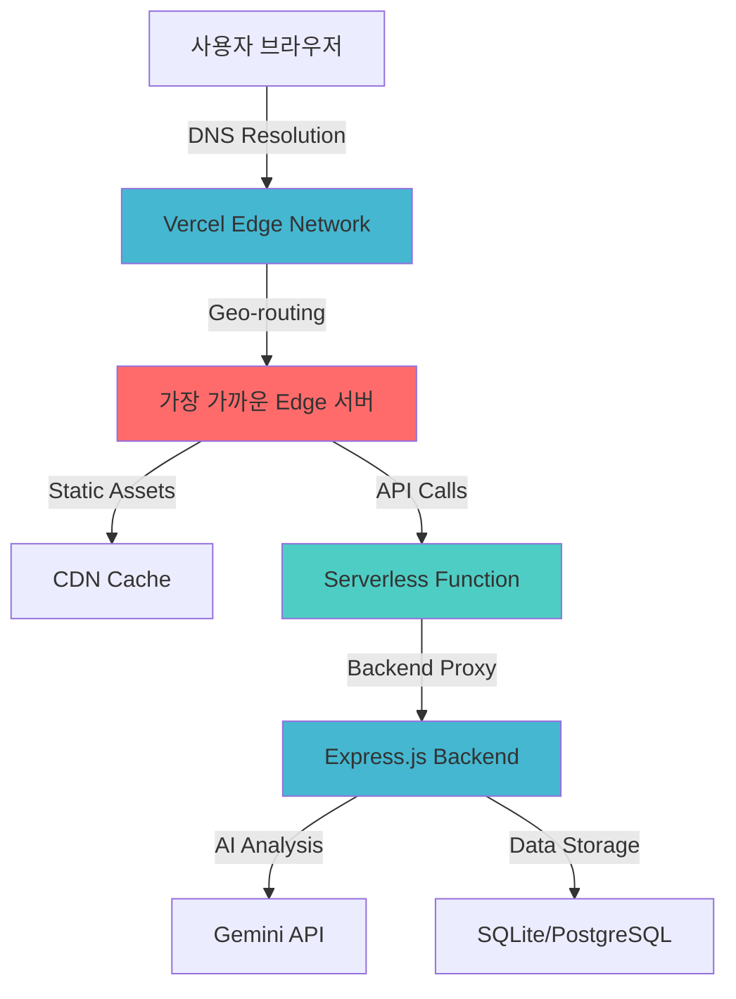

# Criti.AI Challenge Web - Serverless 게이미피케이션 플랫폼

> **"Vercel Edge Runtime의 힘으로 구현한 글로벌 교육 플랫폼"**  
> Serverless Functions와 Edge Computing을 활용하여 전 세계 어디서나 빠른 응답을 보장하는 비판적 사고 훈련 웹 애플리케이션

## 프로젝트 개요

Vercel의 Serverless 아키텍처와 Edge Computing을 활용하여 구축한 실시간 게이미피케이션 기반 미디어 리터러시 교육 플랫폼


**실시간 체험**:

- **Live Platform**: [https://criti-ai.vercel.app](https://criti-ai.vercel.app)
- **실시간 게이미피케이션**: 배지 시스템, 레벨 진행, 점수 추적

---

## 아키텍처 및 설계 철학

### Serverless-First 아키텍처

**설계 패턴**: `JAMstack + Serverless Functions + Edge Computing + Micro-frontends`  
전통적인 모놀리식 서버 대신 Vercel의 Serverless Functions를 활용하여 필요한 순간에만 컴퓨팅 리소스를 사용하고, 정적 자산은 Global CDN으로 배포하여 전 세계 어디서나 빠른 로딩 속도를 보장합니다. 백엔드 API와의 통신은 Serverless Proxy를 통해 CORS와 보안 이슈를 해결했습니다.

**Edge Computing 활용도**:



### Vercel 최적화 전략

**라우팅 최적화**

```json
{
  "rewrites": [
    {
      "source": "/api/health",
      "destination": "/api/proxy?apiPath=/health"
    },
    {
      "source": "/api/challenge/(.*)",
      "destination": "/api/proxy?apiPath=/challenge/$1"
    },
    {
      "source": "/challenge/(.*)",
      "destination": "/index.html"
    }
  ]
}
```

**설계 이유**

- SPA 라우팅과 API 프록시 명확히 분리
- 모든 API 요청을 단일 Serverless Function으로 집중
- 정적 자산과 동적 요청 캐싱 전략

### 보안 헤더 최적화

**Production-Grade 보안**

```json
{
  "headers": [
    {
      "source": "/(.*)",
      "headers": [
        { "key": "X-Content-Type-Options", "value": "nosniff" },
        { "key": "X-Frame-Options", "value": "DENY" },
        { "key": "X-XSS-Protection", "value": "1; mode=block" },
        { "key": "Referrer-Policy", "value": "strict-origin-when-cross-origin" }
      ]
    }
  ]
}
```

**정적 자산 캐싱**

```json
{
  "source": "/static/(.*)",
  "headers": [
    { "key": "Cache-Control", "value": "public, max-age=31536000, immutable" }
  ]
}
```

---

## 기술 스택 및 선택 근거

### 핵심 기술 스택

- **Framework**: React 19 + TypeScript + Emotion
- **Build System**: Vite + Vercel Build API
- **Serverless**: Vercel Functions (Node.js Runtime)
- **Styling**: Emotion CSS-in-JS + Design System
- **State Management**: React Hooks + localStorage
- **Deployment**: Vercel Edge Network + Global CDN

### 핵심 기술 선택 이유

**Vercel Serverless Functions**: Cold Start 시간을 최적화하여 사용자가 지연을 체감하지 않도록 구현. Auto-scaling으로 트래픽 급증 시에도 안정적 서비스 제공.

**Vite + React 19**: 빠른 빌드 속도로 개발 생산성 극대화. React 19의 Concurrent Features를 활용하여 UI 응답성 향상. ESM 기반 번들링으로 브라우저 캐싱 효율성 개선.

**Emotion CSS-in-JS**: Styled-components 대비 더 작은 번들 크기와 향상된 성능. TypeScript와 통합되어 스타일 코드의 타입 안전성 확보. 디자인 토큰 시스템으로 일관된 UI/UX 구현.

**Vercel Edge Network**: Cloudflare와 AWS CloudFront 대비 더 나은 Next.js/React 최적화. 자동 이미지 최적화와 코드 스플리팅으로 초기 로딩 시간 단축.


---

## 문제 및 해결 과정

### 1: Serverless 환경에서의 Backend API 프록시 설계

**상황 및 문제점**: 프론트엔드에서 별도의 Express.js 백엔드 API를 호출해야 하는데, CORS 정책과 API 키 보안 문제가 발생했습니다. 또한 Serverless 환경의 Cold Start와 timeout 제한- 내에서 안정적인 프록시를 구현해야 했습니다.

**고려한 해결책 및 최종 선택**

1. **클라이언트 직접 호출**: CORS와 보안 문제
2. **Vercel Proxy 설정**: 복잡한 설정과 제한사항
3. **Next.js API Routes**: 프레임워크 종속성
4. **Custom Serverless Function**: 최대 유연성과 제어권

**구현 과정 및 결과**

```javascript
// api/proxy.js
export default async function handler(req, res) {
  console.log("=== API Proxy Function Called ===");
  console.log("Method:", req.method, "URL:", req.url);
  console.log("Environment BACKEND_URL:", process.env.BACKEND_URL);

  // CORS 설정
  res.setHeader("Access-Control-Allow-Credentials", true);
  res.setHeader("Access-Control-Allow-Origin", "*");
  res.setHeader(
    "Access-Control-Allow-Methods",
    "GET,OPTIONS,PATCH,DELETE,POST,PUT"
  );

  try {
    const BACKEND_URL = process.env.BACKEND_URL || "http://localhost:3001";
    let targetPath = req.query.apiPath || "/";

    // Intelligent path routing
    if (targetPath === "/health") {
      targetPath = "/health";
    } else if (!targetPath.startsWith("/api/")) {
      targetPath = "/api" + targetPath;
    }

    const backendUrl = `${BACKEND_URL}${targetPath}`;

    // Optimized request with timeout
    const controller = new AbortController();
    const timeout = setTimeout(() => controller.abort(), 8000); // 8초 타임아웃

    const backendResponse = await fetch(backendUrl, {
      method: req.method,
      headers: {
        "Content-Type": "application/json",
        "User-Agent": "Vercel-Proxy/1.0",
      },
      body: req.method !== "GET" ? JSON.stringify(req.body) : undefined,
      signal: controller.signal,
    });

    clearTimeout(timeout);

    const responseData = await backendResponse.json();
    res.status(backendResponse.status).json(responseData);
  } catch (error) {
    // Detailed error handling for production debugging
    let errorMessage = "Internal proxy error";
    if (error.code === "ECONNREFUSED") {
      errorMessage = "Backend server connection refused";
    } else if (error.name === "AbortError") {
      errorMessage = "Backend server timeout";
    }

    res.status(500).json({
      success: false,
      error: errorMessage,
      code: error.code || "UNKNOWN",
      timestamp: new Date().toISOString(),
    });
  }
}
```

### 번들 최적화

**코드 스플리팅 전략**

```typescript
// vite.config.ts - 청크 최적화
export default defineConfig({
  build: {
    rollupOptions: {
      output: {
        manualChunks: {
          vendor: ["react", "react-dom"],
          emotion: ["@emotion/react", "@emotion/styled"],
          utils: ["./src/utils/", "./src/services/"],
        },
      },
    },
  },
});
```

